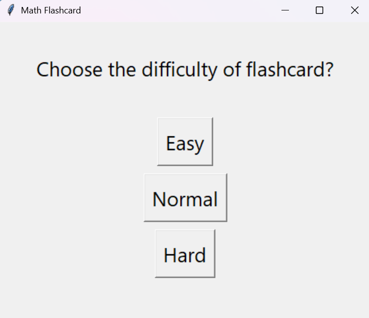
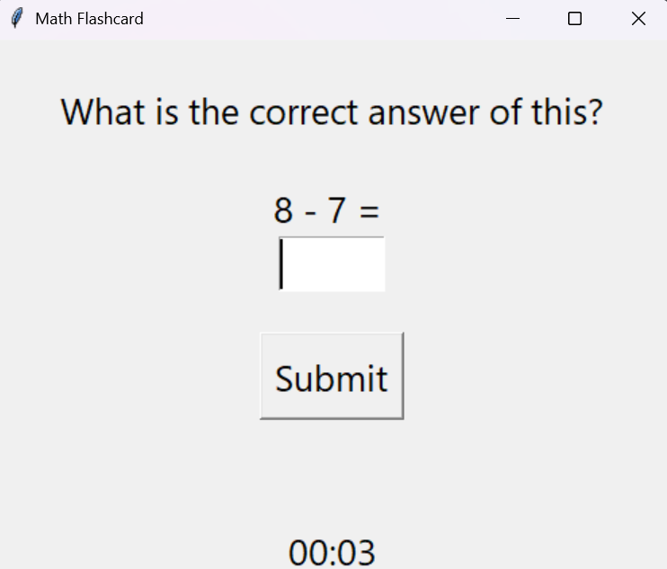

# Math Flashcard

A simple and interactive math flashcard application built using Python's Tkinter GUI library and NumPy. This educational tool helps users practice basic arithmetic problems at different difficulty levels.

## Features

- Choose from three difficulty levels: Easy, Normal, Hard.
- Randomly generated arithmetic questions (addition, subtraction, multiplication, division).
- A built-in timer to track how long you've been practicing.
- Input checking with feedback for correct or incorrect answers.
- Clean and intuitive GUI.

## Screenshots




## Requirements

- Python 3.x
- NumPy
- Tkinter (usually comes with Python standard library)

You can install NumPy using:

```bash
pip install numpy
